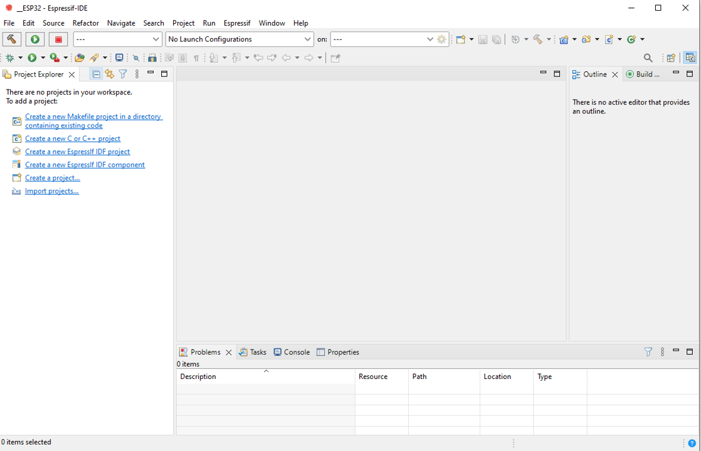

# การใข้งาน Serial port และ serial terminal บน ESP-idf
## 1 การสร้าง Project

### 1.1 เปิดโปรแกรม ESP-IDF 

เปิดโปรแกรม ESP-IDF และเลือก workspace ถ้ายังไม่มี project ใด ๆ ใน work space จะมี links ปรากฏขึ้นมาเพื่อให้เลือกกิจกรรมที่ต้องการ ดังรูปที่ 1

<B> รูปที่ 1 </B>  หน้าต่างโปรแกรม ESP-IDF

### 1.2 สร้าง Project "Hello_Serial"

จากหน้าแรก เราสามารถสร้าง project ใหม่ได้ 2 วิธีคือ เลือกจาก Link ในแท็บ Project Explorer หรือสร้างจากเมนู ดังรูปที่ 2 และ 3

<B> รูปที่ 2 </B> การสร้าง Project ใหม่โดยเลือกจากลิงค์ `Create a new EspressIf IDF project`

<B> รูปที่ 3 </B>  การสร้าง Project ใหม่โดยเลือกจากเมนู `File`  -> `New`  -> `EspressIf IDF project`

### 1.2 กำหนดชื่อ Project

<B> รูปที่ 4 </B>  กำหนดชื่อและสร้าง Project 

1. ตั้งชื่อ project โดยจะต้องไม่มีอักระพิเศษหรือช่องว่างระหว่างคำ ตามข้อกำหนดการตั้งชื่อของ ESP-IDF
2. คลิก Finish เพื่อให้ ESP-IDF เริ่มสร้าง project

