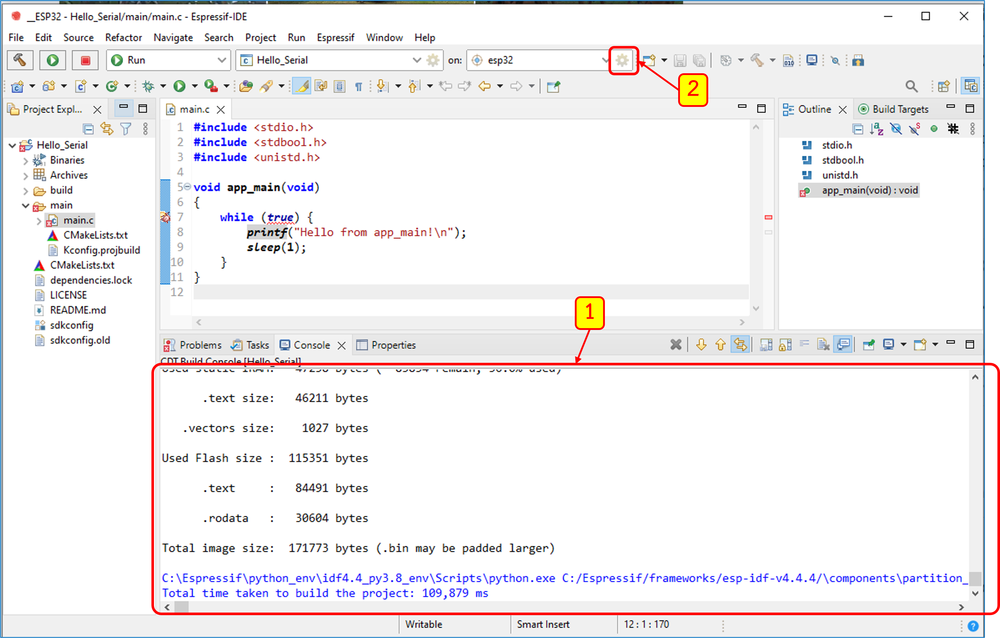
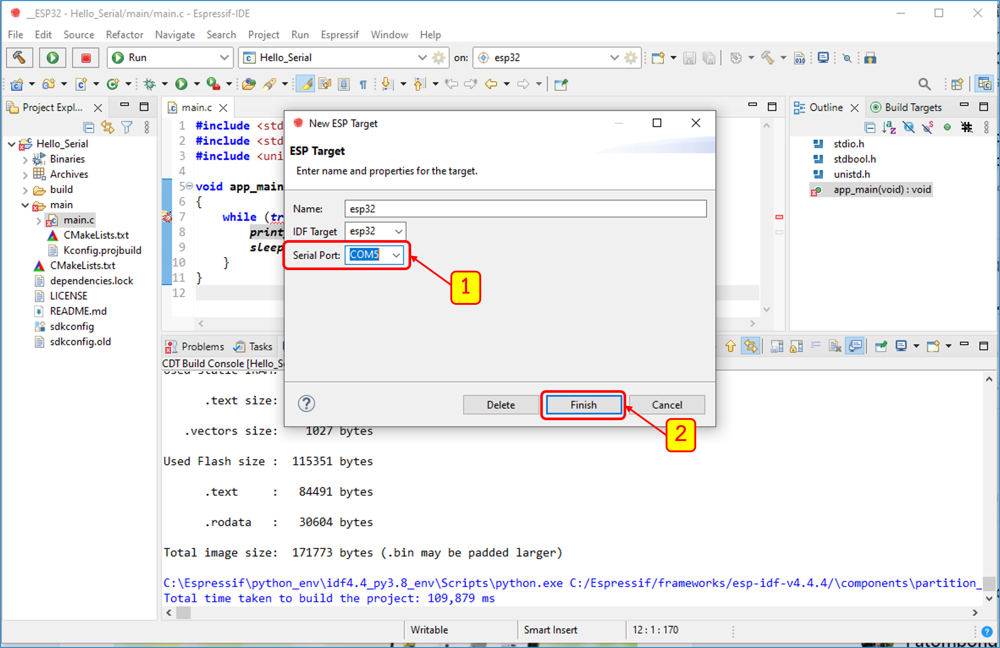
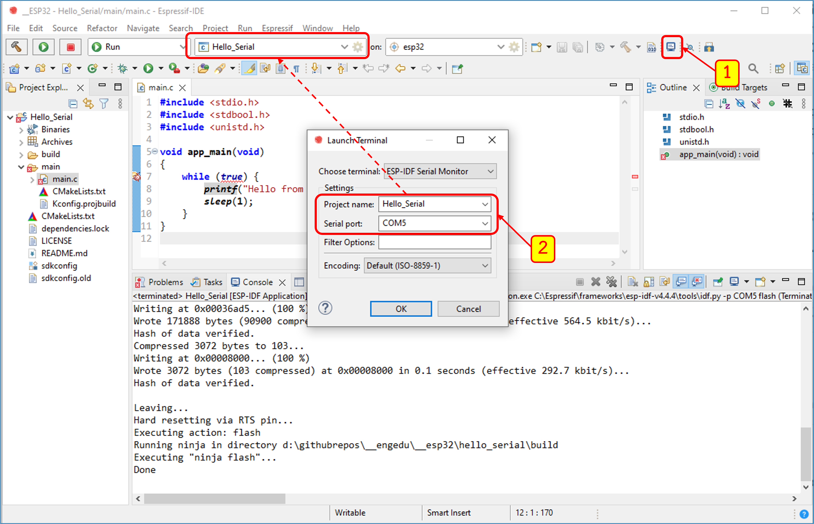
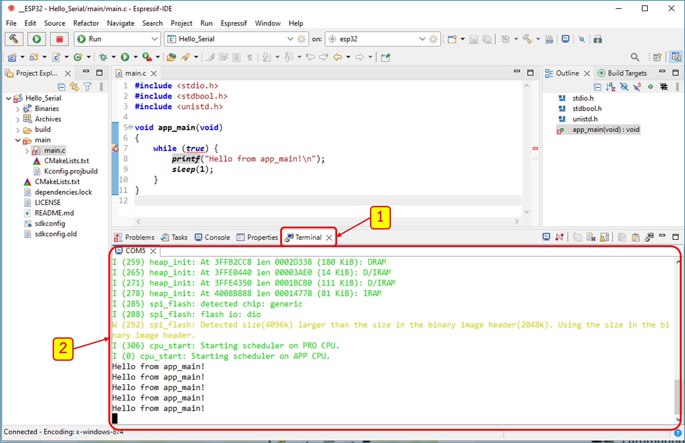

# การใข้งาน Serial port และ serial terminal บน ESP-idf
## 1 การสร้าง Project ใหม่

### 1.1 เปิดโปรแกรม ESP-IDF 

เปิดโปรแกรม ESP-IDF และเลือก workspace ถ้ายังไม่มี project ใด ๆ ใน work space จะมี links ปรากฏขึ้นมาเพื่อให้เลือกกิจกรรมที่ต้องการ ดังรูปที่ 1

<B> รูปที่ 1 </B>  หน้าต่างโปรแกรม ESP-IDF

### 1.2 สร้าง Project "Hello_Serial"

จากหน้าแรก เราสามารถสร้าง project ใหม่ได้ 2 วิธีคือ เลือกจาก Link ในแท็บ Project Explorer หรือสร้างจากเมนู ดังรูปที่ 2 และ 3

<B> รูปที่ 2 </B> การสร้าง Project ใหม่โดยเลือกจากลิงค์ `Create a new EspressIf IDF project`

<B> รูปที่ 3 </B>  การสร้าง Project ใหม่โดยเลือกจากเมนู `File`  -> `New`  -> `EspressIf IDF project`

[1] เลือก `File`

[2] เลือก `New`

[3] เลือก `EspressIf IDF project`

### 1.3 กำหนดชื่อ Project

<B> รูปที่ 4 </B>  กำหนดชื่อและสร้าง Project 

[1] ตั้งชื่อ project โดยจะต้องไม่มีอักระพิเศษหรือช่องว่างระหว่างคำ ตามข้อกำหนดการตั้งชื่อของ ESP-IDF

[2] คลิก Finish เพื่อให้ ESP-IDF เริ่มสร้าง project

### 1.4 ตรวจสอบ  Project ที่ ESP-IDF สร้างให้
เมื่อเสร็จสิ้นกระบวนการสร้าง  Project ให้คลี่โหนดของโฟลเดอร์ `Hello_Serial` และ `main` จนเห็นไฟล์ `main.c` จากนั้นดับเบิ้ลคลิก `main.c` เพื่อเปิดไฟล์ 

<B> รูปที่ 5 </B>  หน้าต่าง ESP-IDF และ source code ของ main.c 

[1] ตำแหน่งที่ตั้งของ  `main.c`

[2] เนื้อหาของไฟล์  `main.c`

_หมายเหตุ_ ในการทดลองนี้เราจะยังไม่ทำการแก้ได ๆ ในไฟล์ `main.c`

### 1.5 ตรวจสอบตระกูลของชิปที่ใช้ใน project

ในการสร้าง project เพื่อ download ลงบนชิปนั้นเราต้องเลือกตระกูลของชิปใน project ให้ตรงกับชิปบนบอร์ด ในบอร์ดทดลองได้ติดตั้งชิป ESP32 ดังนั้นให้เลือกให้ตรงตามตัวอย่างในรูปที่ 6 

<B> รูปที่ 6 </B>  การเลือกตระกูลของชิปที่ใช้ใน project

ESP-IDF จะถามเพื่อยืนยันการเลือกตระกูลของชิป ซึ่งไฟล์ต่างๆ ที่เกิดจากการคอมไพล์และ build ก่อนหน้านี้ (ถ้ามี) จะถูกลบออกเป็นผลให้ต้องใช้เวลาในการ build นานขึ้น ให้ตอบ `Yes`

<B> รูปที่ 7 </B>  คำเตือนเมื่อต้องการเปลี่ยนตระกูลของ chip ที่จะใช้ใน project

ให้ตอบ `Yes`

## 2 การ build และ download Project 

### 2.1 การ build Project

<B> รูปที่ 8 </B> การ build project

### 2.2 การตั้งค่าการ download Project
เมื่อ project ถูก build จนเสร็จเรียบร้อย โปรแกรม ESP-IDF จะรายงานผลการสร้าง (ในตัวอย่างไม่ควรมี error ใดๆ เพราะเรายังไม่ได้แก้ไข source code ของไฟล์ `main.c`) ตามปรากฏใน [1] ของรูปที่ 9 ให้กดปุ่มรูปเฟืองตาม [2] เพื่อกำหนดรายละเอียดของพอร์ตที่จะเชื่อมต่อ

<B> รูปที่ 9 </B>  ผลการ build  project และการกำหนดหมายเลข Serial port

เมื่อกดปุ่มรูปเฟืองตาม [2] ในรูปที่ 9 จะปรากฏหน้าต่างให้เลือกหมายเลข Serial port ให้เลือกจาก drop down box ตาม [1] ในรูปที่ 10 จากนั้นกด Finish  ตาม [2]

<B> รูปที่ 10 </B>  หน้าต่างการกำหนดหมายเลข Serial port

### 2.2 การ download Project

<B> รูปที่ 11 </B>  การ download Project

กดปุ่ม  play เพื่อ  download project ลงบอร์ด ESP32

### 2.2 การเปิด Serial terminal

<B> รูปที่ 12 </B>  การกำหนดชื่อ project และหมายเลข Serial port เพื่อเปิด Serial terminal

[1] กดปุ่ม Terminal เพื่อเปิดหน้าต่าง Launch Terminal 

[2] กำหนดชื่อ project (ชื่อเดียวกับชื่อ project ใน ESP-IDF) และหมายเลข Serial port (ใช้หมายเลขพร์อเดียวกับตอน download project)

<B> รูปที่ 13 </B>  การแสดงช้อมูลใน Serial Terminal

--------
